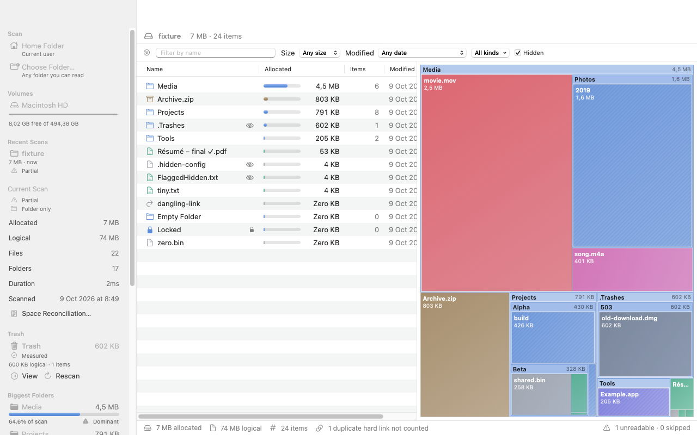
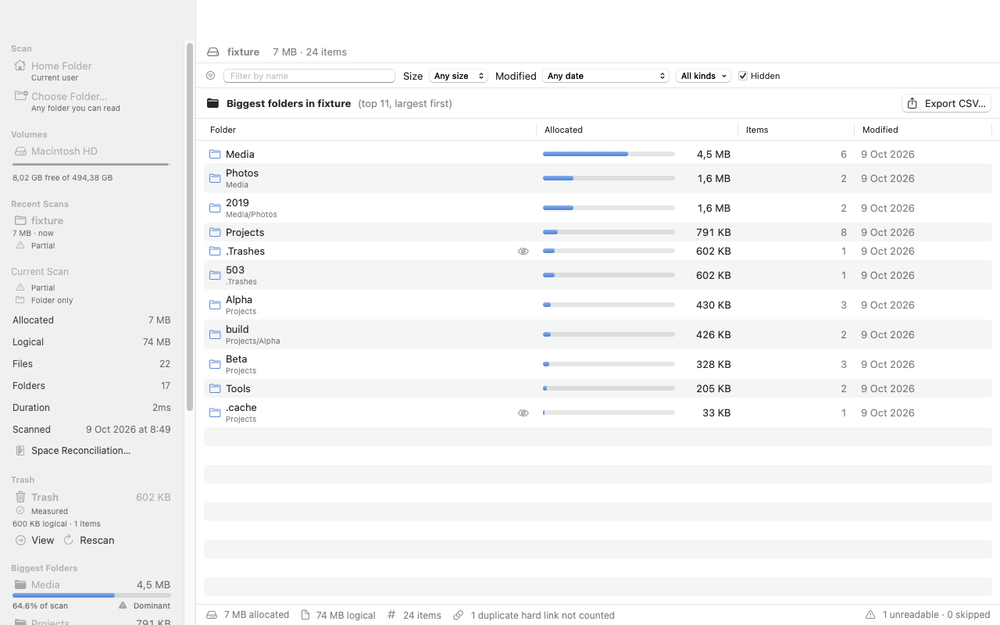
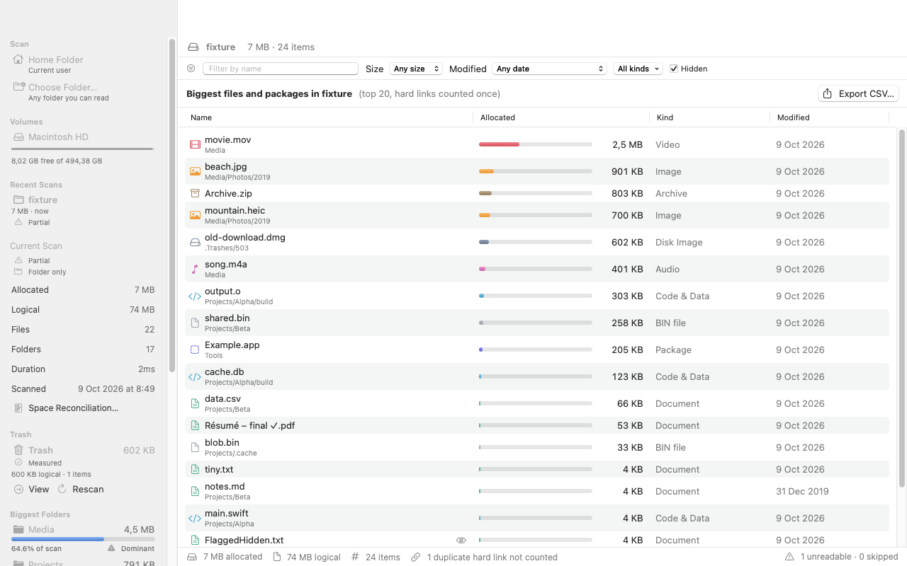
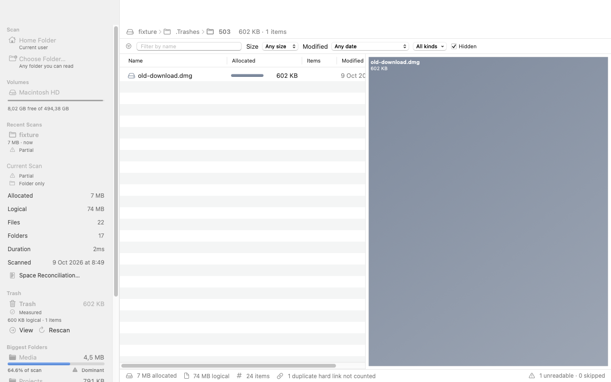
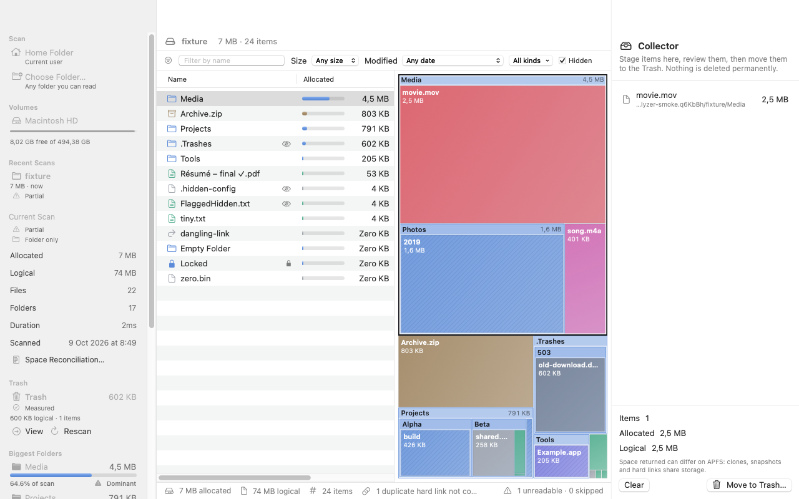

# Disk Analyzer

A native macOS app that shows what takes up space on a disk. Pick your home folder, the
data volume or any folder; Disk Analyzer walks it in the background, then lets you explore
the result as a size-sorted hierarchy and squarified treemap, rank the biggest folders and
files separately, inspect the Trash, filter, preview with Quick Look, reveal in Finder and,
if you choose to, move items to the Trash.

- **Metadata only.** The scan reads `lstat(2)` information and never opens file contents.
- **Nothing is deleted permanently.** The only destructive action is an explicit,
  confirmed **Move to Trash**, which you can undo from the Trash.
- **Honest numbers.** Both *allocated* and *logical* sizes are shown, hard links are counted
  once, and everything the scan could not read is listed instead of silently ignored.
- **Results that survive a relaunch.** The last scan of each folder is saved on your Mac and shown
  again at launch, labelled with how much the volume changed since. Nothing rescans on its own.
- **Zero third-party dependencies.** Swift, SwiftUI, AppKit and Foundation only.

Requires macOS 14 Sonoma or later. Apple silicon and Intel (`--universal` build).

## Screenshots

### Explore and treemap



### Biggest folders



### Biggest files



### Trash



### Collector



## Features

| Area | What you get |
|------|--------------|
| Scan roots | Home folder, any mounted volume (the system volume maps to its Data volume), or any folder via the Open panel |
| Scanning | Asynchronous, cancellable at any time (⌘.), live progress, stays on one volume by default like `du -x` (File > Stay on One Volume) |
| Rescanning | **Rescan All** (⌘R) scans the whole root again. **Rescan This Folder** (⇧⌘R or right-click) rescans one folder and swaps it in only when that scan finishes; stopping it keeps the previous results. **Scan as New Root** starts a full scan at a folder |
| Saved scans | The last scan of each root is saved and the most recent one is shown at launch, without scanning. **Recent Scans** in the sidebar lists up to 10 roots; a folder that was renamed, replaced, or is on a disconnected volume says so and is not opened |
| Space Reconciliation | ⌥⌘S: the volume's used, available and purgeable space next to what the scan measured, what is not attributed or shared, what was not readable, and how much the volume changed during and since the scan. Opens macOS Storage settings |
| Status labels | Complete or Partial, Whole volume or Folder only, Changed since scan, Stale, Restored; each with a symbol and an explanation |
| Sizes | **Allocated** (`st_blocks × 512`) and **Logical** (`st_size`), switchable everywhere |
| Hierarchy | Folder listing with share bars, largest sibling first by default, sortable columns, breadcrumb navigation, ⌘↑ / ⌘↓ |
| Biggest folders | Top 500 ordinary folders below the current location, ranked globally by allocated or logical subtree size; locations, item counts, drill-down and CSV export. The sidebar keeps the five biggest top-level folders visible and labels folders over 25% or 50% of the scan |
| Treemap | Squarified layout, three nested levels, hover details, click to select, double-click to drill down; small items grouped into one tile; hard-link duplicates get no area |
| Biggest files | Top 500 files and packages below the current folder, with their location; CSV export |
| Filters | Name (case- and accent-insensitive), minimum size, modification age, kind, hidden items; folders stay visible when something inside matches |
| Finder | Quick Look (Space or ⌘Y), Reveal in Finder (⌥⌘R), Copy Path |
| Collector | Stage items for review (⌘K). Overlapping selections are merged and a hard-linked file is counted once, so nothing counts twice. Folders the scan could not measure, and files that changed since the scan (another size or date), are not accepted. Kept across a rescan of the same folder |
| Trash sizing | Explicit allocated and logical size, item count and coverage status for the current user's `~/.Trash` or `.Trashes/<uid>` on a scanned volume. **View** drills into it and **Rescan** refreshes only that folder. Missing scope, unreadable data and changes after an in-app move are never shown as a trustworthy zero |
| Move to Trash | Confirmation dialog, every item re-validated on disk right before it moves (same object, still inside the scanned folder after resolving aliases; protected system and account folders, folders that contain one, and cloud storage roots refused, also through aliases), per-item results; disabled while scanning |
| Skipped items | Permission-denied, privacy-protected, unreadable and other-volume folders, with counts, reasons, CSV export and a shortcut to Privacy & Security settings |

## Install from source

You need the Xcode **Command Line Tools** with Swift 6 or later (`xcode-select --install`).
A full Xcode install also works; nothing here requires it.

```bash
git clone https://github.com/brunokktro/DiskAnalyzer.git
cd DiskAnalyzer
scripts/package-app.sh            # builds dist/Disk Analyzer.app (add --universal for arm64 + x86_64)
open "dist/Disk Analyzer.app"
```

The bundle is ad-hoc signed. Because it is not notarized, a copy downloaded from the internet
is blocked by Gatekeeper; open it with right-click > Open, or build it yourself as above.
To sign with your own identity: `SIGN_IDENTITY="Developer ID Application: …" scripts/package-app.sh`.

## Using it

1. Choose **Scan Home Folder**, a volume in the sidebar, or **Choose Folder…** (⌘O). Next time
   you open the app, the last results are already there; use **Rescan All** (⌘R) when you want
   fresh numbers.
2. Explore: double-click folders or treemap tiles to go deeper, use the breadcrumb or ⌘↑ to go back.
3. Switch **Allocated / Logical** in the toolbar. Open **Biggest Folders** (⌘2) for the
   global folder ranking or **Biggest Files** (⌘3) for files and packages.
4. Use the **Trash** card in the sidebar to see its measured size, drill into it or rescan only
   the Trash. After Disk Analyzer moves something there, the card requires a rescan instead of
   presenting the previous total as current.
5. Right-click anything for Quick Look, Reveal in Finder, **Add to Collector**, **Rescan This
   Folder** or **Scan as New Root**.
6. Open the Collector (⌥⌘C), review, then **Move to Trash…** and confirm.
7. To see why the volume's used space differs from the scan, open **Space Reconciliation** (⌥⌘S).

### Full Disk Access

macOS privacy protection (TCC) hides some folders, such as Mail, Messages and Safari data,
from apps that do not have **Full Disk Access**. Disk Analyzer reports those folders as
*Blocked by macOS privacy protection* and shows the count in the status bar. If you want them
measured, add the app in **System Settings > Privacy & Security > Full Disk Access** and rescan.
The app works without it.

## What the numbers mean

**Allocated** is what the file system reports as in use for each file (`st_blocks × 512`,
see `man 2 stat`). It is the best available estimate of the space a file occupies, and the
default ranking. **Logical** is the size of the content (`st_size`), what Finder lists as
"size". A sparse disk image can be gigabytes logically and a few kilobytes allocated.

Neither number is the exact space you get back by deleting something on APFS:

- **Clones** (Finder duplicates, `cp -c`) share blocks; each copy reports the full allocation.
- **Snapshots** (Time Machine local snapshots, system updates) keep deleted blocks alive.
- **Hard links** keep data on disk while another link exists. The scanner and the Collector
  count an inode once, and the Collector warns about hard-linked files.
- **Firmlinks.** On the startup disk, `/Users`, `/Applications` and other folders are firmlinks
  to the same folders on the Data volume. Choosing the startup disk scans its Data volume, and
  any folder reached a second time through another path is counted once and listed as
  *Already counted at another path*.
- **Purgeable** space and file-system compression are not visible per file.

Disk Analyzer therefore labels freed space as approximate and never claims APFS physical
reclaim precision.

### Space Reconciliation

For a scan of a whole volume, the used space reported by the file system (capacity minus
available) is split into what the scan measured and what is **not attributed or shared**: other
volumes in the same APFS container (system, VM, preboot), local snapshots, metadata, purgeable data
and folders the scan could not read. The parts always add up to the used space and none is
negative. When the scan measures **more** than the volume uses (clones report their full size in
every copy), the difference is shown as *Measured beyond used*, not hidden. After a folder
rescan, the used space in that split is the used space at the end of the scan plus what the
rescans measured, and the window shows both parts, so space freed or written in a rescanned
folder never appears as unattributed or as measured beyond used. *Purgeable* is the
difference between the space available for important data and the space available now, an
estimate macOS provides.

A scan of one folder is labelled **Folder only** and is never compared with the volume's used
space. **Changed since scan** and **Stale** come from reading the volume again: the used space
moved by more than max(100 MB, 0.1% of capacity), or by at least max(1 GB, 1% of capacity),
compared with what the results account for: the full scan plus what folder rescans measured. A
folder rescan keeps the full scan's baselines, so space that changed outside the rescanned folder
still marks the results as changed or stale. The totals agree with `du -k -x` on the same folder, which is how the tests
cross-check them. Details in [docs/ARCHITECTURE.md](docs/ARCHITECTURE.md#size-semantics).

## Product references and deliberate scope

Disk Analyzer uses the strongest ideas from the two products that motivated it, adapted to a
native and local-only macOS app rather than copied feature for feature.

| Reference | Adopted here |
|-----------|--------------|
| [TreeSize](https://www.jam-software.com/treesize/features.shtml) | Real-time folder hierarchy, largest sibling first, global Biggest Folders and Biggest Files rankings, allocated and logical sizes, share bars, filters, file-type breakdown, saved scan results, folder rescans and CSV exports |
| [Diskaroo](https://bravely.dev/diskaroo) | Squarified treemap, drill-down and breadcrumbs, recent scans, any-folder and any-volume entry points, Quick Look, Reveal in Finder, Collector review flow and explicit Trash sizing |

This release intentionally does not copy TreeSize's Windows/network administration, scheduled
reports or bulk rename, and does not copy Diskaroo's account system, permanent deletion, sunburst
or content-reading duplicate finder. Those are separate product decisions. The scanner remains
metadata-only, the app remains local-only, and removal remains reversible through the Trash.

## Development

```bash
scripts/test.sh                   # 217 unit and integration tests (Swift Testing)
scripts/package-app.sh            # release build + .app bundle
scripts/smoke-test.sh             # packaged app, relaunch, 49 checks and 6 opaque screenshots
scripts/make-fixture.sh /tmp/da   # writes the test fixture tree for manual exploration
```

See [CONTRIBUTING.md](CONTRIBUTING.md) for the project layout and conventions, and
[docs/ARCHITECTURE.md](docs/ARCHITECTURE.md) for how the scanner, the tree and the UI fit together.

## Known limitations

- Very large scans hold the whole tree in memory: about 470,000 entries use ~265 MB including
  the UI. Tens of millions of entries need several GB.
- Results are a snapshot. Changes after the scan are not tracked file by file; the labels only say
  how much the volume's used space moved. Rescan with ⌘R, or ⇧⌘R for one folder.
- Saved scans hold the file names of the scanned folders. They stay on your Mac; see
  [SECURITY.md](SECURITY.md#saved-scans) for where they live and how to remove them.
- File kinds come from file extensions, not content inspection.
- Not sandboxed, so it can scan the home folder and volumes without asking per folder.
  This also means it is not distributable through the Mac App Store as is.
- English UI only for now.

## License

[MIT](LICENSE)
