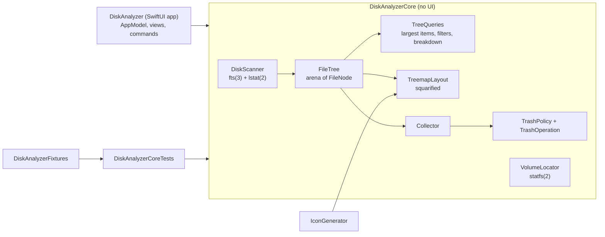

# Architecture

Disk Analyzer is a Swift package with one library holding all logic and a thin SwiftUI app
on top. Everything that can be tested without a window lives in `DiskAnalyzerCore`.

| Target | Kind | Role |
|--------|------|------|
| `DiskAnalyzerCore` | library | Scanner, tree model, queries, treemap layout, Collector, Trash policy, volumes, CSV |
| `DiskAnalyzer` | executable | SwiftUI app: `AppModel` (state), views, menu commands, smoke-test mode |
| `DiskAnalyzerFixtures` | library | Deterministic on-disk fixture tree used by tests and the generator |
| `FixtureGenerator` | executable | Writes the fixture to a folder for manual testing |
| `IconGenerator` | executable | Renders the app icon from code with the app's own treemap layout |
| `DiskAnalyzerCoreTests` | tests | Swift Testing suites, unit and integration |

## Scanning

`DiskScanner` walks the tree with `fts_open(3)` using
`FTS_PHYSICAL | FTS_COMFOLLOW | FTS_NOCHDIR`:

- `FTS_PHYSICAL` returns symbolic links as links and never follows them, so link loops cannot occur.
- `FTS_COMFOLLOW` follows the root only, so choosing a symlinked folder scans its target.
- `FTS_NOCHDIR` keeps the process working directory untouched, which makes the walk safe to
  run on a background thread while the UI keeps working.

For every entry fts already performed an `lstat(2)`; the scanner copies `st_size`, `st_blocks`,
`st_mtimespec`, `st_nlink`, `st_dev`, `st_ino` and `st_flags`. It never opens a regular file, which
a test proves by measuring a file with mode `000`.

| fts info | Meaning | Scanner action |
|----------|---------|----------------|
| `FTS_D` | directory, pre-order | create node; skip subtree if its `(st_dev, st_ino)` was already visited, if on another device, or if excluded |
| `FTS_DP` | directory, post-order | ignored (aggregation happens after the walk) |
| `FTS_F` | regular file | create node; detect duplicate hard links by `(st_dev, st_ino)` |
| `FTS_SL`, `FTS_SLNONE` | symbolic link | create node, never followed |
| `FTS_DNR` | directory not readable | flag the node, record issue with `fts_errno` |
| `FTS_NS`, `FTS_ERR` | no stat / error | record issue; root errors throw |
| `FTS_DC` | directory cycle | flag, record issue |

`FTS_DC` only reports a folder that is its own ancestor. A folder reached a second time from
somewhere else is not a cycle to fts: the APFS firmlinks (`/Users` and
`/System/Volumes/Data/Users` have the same `st_dev` and `st_ino`; system-volume inodes carry a
high bit, so identities never collide inside a volume group) and hard-linked folders in HFS+
Time Machine backups. The walker remembers every folder identity; a repeat is flagged
`alreadyCounted` and `hardLinkDuplicate`, skipped with `FTS_SKIP`, never summed, reported as an
issue (not a failure), and refused by the Collector.

`errno` is mapped to an issue kind: `EACCES` is a POSIX permission denial, `EPERM` is usually
macOS privacy protection (TCC), anything else is "unreadable". Issues are capped in memory
(`maxRecordedIssues`, 5,000) while the per-kind counters stay exact.

### Concurrency and cancellation

`scan(_:progress:)` runs the blocking walk in a detached task at `.userInitiated` priority and
forwards cancellation with `withTaskCancellationHandler`. The walk calls
`Task.checkCancellation()` every 256 entries, so a cancelled scan stops within a few hundred
entries. Progress is reported at most every `progressInterval` (100 ms) from the same check, so
the UI is never flooded. `AppModel` tags each scan with a generation number and drops results
or progress from a superseded scan.

### Building the tree

fts visits parents before children, so node IDs are assigned in pre-order and every child has a
larger ID than its parent. After the walk, `FileTree.assemble` does two linear passes:

1. A reverse pass adds each node's sizes and item count to its parent (hard-link duplicates add
   nothing).
2. A counting pass lays all children out contiguously in `childIndex` and sorts each sibling
   range by allocated size, largest first.

`FileNode` is a compact value (name, parent index, kind, flags, two sizes, item count, mtime,
child range). The whole tree is one `Sendable` struct, handed to the main actor as a value.

## Size semantics

| Metric | Source | Notes |
|--------|--------|-------|
| Allocated | `st_blocks × 512` (`man 2 stat`: blocks are 512-byte units) | Default. Matches `du -k`. Directories add their own blocks (0 on APFS) |
| Logical | `st_size` | What Finder calls "size". Sparse files exceed their allocation |

The Foundation keys `URLResourceKey.fileAllocatedSizeKey` and `totalFileAllocatedSizeKey`
describe the same allocation; the scanner reads `lstat(2)` directly because fts already did the
call and resource values would cost a second system call per entry. Allocation is not the space
returned by deleting a file on APFS: clones share blocks, snapshots retain them, other hard links
keep the inode, and purgeable space is not visible per file. The UI words freed space as
approximate for that reason.

The tests cross-check the scanner against `lstat(2)` per file and `du -s -k -x` for the whole
fixture. On a real `/Applications` folder (470,531 entries) the allocated total equalled
`du -sk -x` × 1024 to the byte.

## Volumes

`VolumeLocator` uses `statfs(2)` to find the mount point of a path and
`FileManager.mountedVolumeURLs(includingResourceValuesForKeys:options:)` with
`.skipHiddenVolumes` to list user-visible volumes. On the APFS system volume group, `/` is the
sealed read-only system volume and user data lives on `/System/Volumes/Data`, reached from `/`
through firmlinks; scanning the Data volume avoids walking the system twice. The sidebar and
the Open panel both apply this mapping (`VolumeLocator.preferredScanRoot(for:)`), and the walker's
folder-identity check keeps any other root honest. Nothing is
hardcoded per user: the home folder comes from `FileManager.homeDirectoryForCurrentUser`.

## Queries and treemap

- `TreeQueries.largestItems` walks the subtree once with a bounded min-heap (O(n log k)).
  Packages are listed as single items by default; their insides are not.
- `TreeQueries.filteredChildren` keeps a folder when the folder or anything inside it matches,
  so filtering never hides the path to a match.
- `TreemapLayout` implements the squarified algorithm (Bruls, Huizing, van Wijk, *Squarified
  Treemaps*, 2000): items are added to a row while the worst aspect ratio improves, then the row
  is laid along the shorter side. Up to three levels are nested, each expanded folder gets a label
  strip, and the tail of items smaller than 36 pt² becomes one hatched "N smaller items" tile.
  Hatching, borders and labels distinguish tiles, so the treemap does not depend on color alone.
  Hard-link duplicates get no area, matching the folder sizes they are not part of. With a filter
  active, tiles keep the area of the whole folder or file (the filter decides which tiles appear,
  not how big they are), so a tile always means real space on disk.

## App layer

`AppModel` is a `@MainActor @Observable` class and the single source of UI state. Views receive
it with `@Bindable`; there is no `@State` anywhere (see CONTRIBUTING for why). Expensive derived
data (rows, largest items, tiles, category breakdown) is cached in `@ObservationIgnored`
properties keyed by tree version, focus, metric, filter and, for tiles, the view size. Pointer
hover lives in a separate `HoverState` object so mouse movement redraws only the treemap.

Finder integration uses public APIs only: `View.quickLookPreview(_:)`,
`NSWorkspace.activateFileViewerSelecting(_:)`, `NSOpenPanel` and `NSSavePanel`.

## Collector and Trash

The Collector keeps non-overlapping paths: adding a folder absorbs collected descendants, adding
something inside a collected folder is a no-op. Totals count each object once: an item the scan
marked as a hard-link duplicate adds nothing (its inode is already counted where the scan met it
first), and two collected files with the same `(st_dev, st_ino)` are summed once. Each item records
its identity from `lstat(2)` when it is collected.

Items the scan did not measure (`unreadable`, `excluded`, `otherVolume` flags, or an invalid name
encoding anywhere on the path) are refused by the Collector and by `TrashOperation`: their sizes
are a lower bound, often zero, so a confirmation based on them would understate what moves. A
folder that merely contains such folders is accepted and reports how many, and the confirmation
dialog says that more than the size shown will move.

Moving to the Trash goes through three gates:

1. A confirmation dialog stating the number of items, their allocated size and, when relevant,
   the unmeasured folders inside them. The action is disabled while a scan is running.
2. `TrashPolicy`, per item, at the moment of the move:
   - lexical checks on the path as written: inside the scanned folder, not the scanned folder
     itself, not a protected location (system folders, `/Users`, the account's home, `Library`,
     `Desktop`, `Documents`, `Downloads`, `Pictures`, `Music`, `Movies`, `Public`, `.Trash`,
     `Library/CloudStorage` and `Library/Mobile Documents`, plus their Data-volume paths and the
     app's own bundle), not a folder that contains a protected location, not a direct child of a
     cloud storage root (a File Provider domain or an iCloud container), not inside the sealed
     `/System`;
   - the entry still exists (`lstat`), with the same type and the same identity as when collected;
   - the parent folder is resolved with `realpath(3)` and the resolved path must still be strictly
     inside the resolved scan root. This stops a folder replaced by a symbolic link after the scan
     from redirecting the move. The entry itself is not resolved: a link is moved as a link;
   - protection (including the ancestor and cloud-root rules) is checked again on the resolved
     path, and by identity against the protected folders (`stat`, which follows aliases and
     firmlinks);
   - not the root of another volume.
3. `FileManager.trashItem(at:resultingItemURL:)`, the same operation as Finder's Move to Trash.

Each item succeeds or fails independently; failures stay in the Collector with the reason. After
the move, `FileTree.markRemoved` hides the node and subtracts its sizes from every ancestor, so
the UI reflects the change without a rescan. The "about N freed" estimate skips hard-linked
items. A rescan of the same folder keeps the Collector, re-measuring each item from the new tree
and telling the user about items that are gone. There is no code path that removes files permanently.

## Packaging

`scripts/package-app.sh` builds the release products with SwiftPM, renders the icon with
`IconGenerator`, converts it with `iconutil(1)`, assembles `Contents/{MacOS,Resources,Info.plist,PkgInfo}`
from `Packaging/Info.plist` and `VERSION` (`CFBundleVersion` is MAJOR×10000 + MINOR×100 + PATCH,
so it always grows; the script rejects a MINOR or PATCH of 100 or more), sets every file time to `SOURCE_DATE_EPOCH`, and signs
ad-hoc with the hardened runtime (`codesign --options runtime`). The app is not sandboxed.

## References

- `man 3 fts`, `man 2 stat`, `man 3 realpath`, `man 2 statfs`, `man 1 du`, `man 1 iconutil`, `man 1 codesign`
- [URLResourceKey.fileAllocatedSizeKey](https://developer.apple.com/documentation/foundation/urlresourcekey/fileallocatedsizekey),
  [totalFileAllocatedSizeKey](https://developer.apple.com/documentation/foundation/urlresourcekey/totalfileallocatedsizekey),
  [isPackageKey](https://developer.apple.com/documentation/foundation/urlresourcekey/ispackagekey),
  [volumeAvailableCapacityForImportantUsageKey](https://developer.apple.com/documentation/foundation/urlresourcekey/volumeavailablecapacityforimportantusagekey)
- [FileManager.trashItem(at:resultingItemURL:)](https://developer.apple.com/documentation/foundation/filemanager/trashitem(at:resultingitemurl:))
- [FileManager.mountedVolumeURLs(includingResourceValuesForKeys:options:)](https://developer.apple.com/documentation/foundation/filemanager/mountedvolumeurls(includingresourcevaluesforkeys:options:))
- [NSWorkspace.activateFileViewerSelecting(_:)](https://developer.apple.com/documentation/appkit/nsworkspace/activatefileviewerselecting(_:))
- [View.quickLookPreview(_:in:)](https://developer.apple.com/documentation/swiftui/view/quicklookpreview(_:in:))
- [NSOpenPanel](https://developer.apple.com/documentation/appkit/nsopenpanel)
