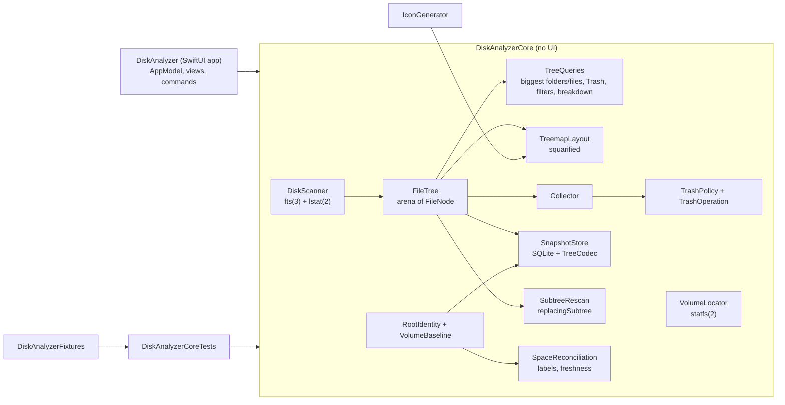

# Architecture

Disk Analyzer is a Swift package with one library holding all logic and a thin SwiftUI app
on top. Everything that can be tested without a window lives in `DiskAnalyzerCore`.

| Target | Kind | Role |
|--------|------|------|
| `DiskAnalyzerCore` | library | Scanner, tree model, queries, treemap layout, Collector, Trash policy, volumes, CSV, saved scans, folder rescans, reconciliation |
| `DiskAnalyzer` | executable | SwiftUI app: `AppModel` (state), views, menu commands, smoke-test mode |
| `DiskAnalyzerFixtures` | library | Deterministic on-disk fixture tree used by tests and the generator |
| `FixtureGenerator` | executable | Writes the fixture to a folder for manual testing |
| `IconGenerator` | executable | Renders the app icon from code with the app's own treemap layout |
| `DiskAnalyzerCoreTests` | tests | Swift Testing suites, unit and integration |

## Scanning

`DiskScanner` walks the tree with `fts_open(3)` using
`FTS_PHYSICAL | FTS_COMFOLLOW | FTS_NOCHDIR`:

- `FTS_PHYSICAL` returns symbolic links as links and never follows them, so link loops cannot occur.
- `FTS_COMFOLLOW` follows the root only, so choosing a symlinked folder scans its target.
- `FTS_NOCHDIR` keeps the process working directory untouched, which makes the walk safe to
  run on a background thread while the UI keeps working.

For every entry fts already performed an `lstat(2)`; the scanner copies `st_size`, `st_blocks`,
`st_mtimespec`, `st_nlink`, `st_dev`, `st_ino` and `st_flags`. It never opens a regular file, which
a test proves by measuring a file with mode `000`.

| fts info | Meaning | Scanner action |
|----------|---------|----------------|
| `FTS_D` | directory, pre-order | create node; skip subtree if its `(st_dev, st_ino)` was already visited, if on another device, or if excluded |
| `FTS_DP` | directory, post-order | ignored (aggregation happens after the walk) |
| `FTS_F` | regular file | create node; detect duplicate hard links by `(st_dev, st_ino)` |
| `FTS_SL`, `FTS_SLNONE` | symbolic link | create node, never followed |
| `FTS_DNR` | directory not readable | flag the node, record issue with `fts_errno` |
| `FTS_NS`, `FTS_ERR` | no stat / error | record issue; root errors throw |
| `FTS_DC` | directory cycle | flag, record issue |

`FTS_DC` only reports a folder that is its own ancestor. A folder reached a second time from
somewhere else is not a cycle to fts: the APFS firmlinks (`/Users` and
`/System/Volumes/Data/Users` have the same `st_dev` and `st_ino`; system-volume inodes carry a
high bit, so identities never collide inside a volume group) and hard-linked folders in HFS+
Time Machine backups. The walker remembers every folder identity; a repeat is flagged
`alreadyCounted` and `hardLinkDuplicate`, skipped with `FTS_SKIP`, never summed, reported as an
issue (not a failure), and refused by the Collector.

`errno` is mapped to an issue kind: `EACCES` is a POSIX permission denial, `EPERM` is usually
macOS privacy protection (TCC), anything else is "unreadable". Issues are capped in memory
(`maxRecordedIssues`, 5,000) while the per-kind counters stay exact.

### Concurrency and cancellation

`scan(_:progress:)` runs the blocking walk in a detached task at `.userInitiated` priority and
forwards cancellation with `withTaskCancellationHandler`. The walk calls
`Task.checkCancellation()` every 256 entries, so a cancelled scan stops within a few hundred
entries. Progress is reported at most every `progressInterval` (100 ms) from the same check, so
the UI is never flooded. `AppModel` tags each scan with a generation number and drops results
or progress from a superseded scan.

### Building the tree

fts visits parents before children, so node IDs are assigned in pre-order and every child has a
larger ID than its parent. After the walk, `FileTree.assemble` does two linear passes:

1. A reverse pass adds each node's sizes and item count to its parent (hard-link duplicates add
   nothing).
2. A counting pass lays all children out contiguously in `childIndex` and sorts each sibling
   range by allocated size, largest first.

`FileNode` is a compact value (name, parent index, kind, flags, two sizes, item count, mtime,
child range). The whole tree is one `Sendable` struct, handed to the main actor as a value.

### Rankings and storage insights

`TreeQueries.largestItems` and `TreeQueries.largestFolders` both walk the current subtree once
and keep a bounded min-heap, so a top-500 view costs `O(n log 500)` time and `O(500)` additional
memory. Biggest Files treats packages as one item. Biggest Folders lists ordinary directories,
prunes packages and obeys the active size metric and filters. The hierarchy itself keeps siblings
largest-first by allocated size and re-sorts only when Logical is selected.

The sidebar's five folder alerts deliberately use only immediate children of the scan root. This
prevents one subtree from appearing repeatedly as parent, child and grandchild in the alert list;
the full Biggest Folders view remains global. Shares above 25% and 50% receive text and an SF
Symbol in addition to the bar, so the warning does not depend on color.

`TreeQueries.trashFolders` finds the current user's home Trash, its APFS Data-volume path and the
`.Trashes/<uid>` directory used by other volumes. `AppModel.trashInsight` separates measured,
partial, empty, changed-since-scan and out-of-scope states. A Trash path blocked by permissions is
never presented as an empty folder. View navigates into the measured node; Rescan uses the same
atomic subtree replacement as any other folder.

## Size semantics

| Metric | Source | Notes |
|--------|--------|-------|
| Allocated | `st_blocks × 512` (`man 2 stat`: blocks are 512-byte units) | Default. Matches `du -k`. Directories add their own blocks (0 on APFS) |
| Logical | `st_size` | What Finder calls "size". Sparse files exceed their allocation |

The Foundation keys `URLResourceKey.fileAllocatedSizeKey` and `totalFileAllocatedSizeKey`
describe the same allocation; the scanner reads `lstat(2)` directly because fts already did the
call and resource values would cost a second system call per entry. Allocation is not the space
returned by deleting a file on APFS: clones share blocks, snapshots retain them, other hard links
keep the inode, and purgeable space is not visible per file. The UI words freed space as
approximate for that reason.

The tests cross-check the scanner against `lstat(2)` per file and `du -s -k -x` for the whole
fixture. On a real `/Applications` folder (470,531 entries) the allocated total equalled
`du -sk -x` × 1024 to the byte.

## Volumes

`VolumeLocator` uses `statfs(2)` to find the mount point of a path and
`FileManager.mountedVolumeURLs(includingResourceValuesForKeys:options:)` with
`.skipHiddenVolumes` to list user-visible volumes. On the APFS system volume group, `/` is the
sealed read-only system volume and user data lives on `/System/Volumes/Data`, reached from `/`
through firmlinks; scanning the Data volume avoids walking the system twice. The sidebar and
the Open panel both apply this mapping (`VolumeLocator.preferredScanRoot(for:)`), and the walker's
folder-identity check keeps any other root honest. Nothing is
hardcoded per user: the home folder comes from `FileManager.homeDirectoryForCurrentUser`.

## Queries and treemap

- `TreeQueries.largestItems` walks the subtree once with a bounded min-heap (O(n log k)).
  Packages are listed as single items by default; their insides are not.
- `TreeQueries.filteredChildren` keeps a folder when the folder or anything inside it matches,
  so filtering never hides the path to a match.
- `TreemapLayout` implements the squarified algorithm (Bruls, Huizing, van Wijk, *Squarified
  Treemaps*, 2000): items are added to a row while the worst aspect ratio improves, then the row
  is laid along the shorter side. Up to three levels are nested, each expanded folder gets a label
  strip, and the tail of items smaller than 36 pt² becomes one hatched "N smaller items" tile.
  Hatching, borders and labels distinguish tiles, so the treemap does not depend on color alone.
  Hard-link duplicates get no area, matching the folder sizes they are not part of. With a filter
  active, tiles keep the area of the whole folder or file (the filter decides which tiles appear,
  not how big they are), so a tile always means real space on disk.

## App layer

`AppModel` is a `@MainActor @Observable` class and the single source of UI state. Next to the
tree it keeps a `SnapshotContext` (root identity, scope, baselines, rescanned folders, and the save
date when the results were restored). It counts every scan it starts (`scanStartCount`); the launch
path only restores, and the smoke test relaunches the app to check the count stays at zero. Views receive
it with `@Bindable`; there is no `@State` anywhere (see CONTRIBUTING for why). Expensive derived
data (rows, biggest folders, biggest files, tiles, category breakdown) is cached in `@ObservationIgnored`
properties keyed by tree version, focus, metric, filter and, for tiles, the view size. Pointer
hover lives in a separate `HoverState` object so mouse movement redraws only the treemap.

Finder integration uses public APIs only: `View.quickLookPreview(_:)`,
`NSWorkspace.activateFileViewerSelecting(_:)`, `NSOpenPanel` and `NSSavePanel`.

## Collector and Trash

The Collector keeps non-overlapping paths: adding a folder absorbs collected descendants, adding
something inside a collected folder is a no-op. Totals count each object once: an item the scan
marked as a hard-link duplicate adds nothing (its inode is already counted where the scan met it
first), and two collected files with the same `(st_dev, st_ino)` are summed once. Each item records
its identity from `lstat(2)` when it is collected.

Items the scan did not measure (`unreadable`, `excluded`, `otherVolume` flags, or an invalid name
encoding anywhere on the path) are refused by the Collector and by `TrashOperation`: their sizes
are a lower bound, often zero, so a confirmation based on them would understate what moves. A
folder that merely contains such folders is accepted and reports how many, and the confirmation
dialog says that more than the size shown will move.

Moving to the Trash goes through three gates:

1. A confirmation dialog stating the number of items, their allocated size and, when relevant,
   the unmeasured folders inside them. The action is disabled while a scan is running.
2. `TrashPolicy`, per item, at the moment of the move:
   - lexical checks on the path as written: inside the scanned folder, not the scanned folder
     itself, not a protected location (system folders, `/Users`, the account's home, `Library`,
     `Desktop`, `Documents`, `Downloads`, `Pictures`, `Music`, `Movies`, `Public`, `.Trash`,
     `Library/CloudStorage` and `Library/Mobile Documents`, plus their Data-volume paths and the
     app's own bundle), not a folder that contains a protected location, not a direct child of a
     cloud storage root (a File Provider domain or an iCloud container), not inside the sealed
     `/System`;
   - the entry still exists (`lstat`), with the same type and the same identity as when collected;
   - the parent folder is resolved with `realpath(3)` and the resolved path must still be strictly
     inside the resolved scan root. This stops a folder replaced by a symbolic link after the scan
     from redirecting the move. The entry itself is not resolved: a link is moved as a link;
   - protection (including the ancestor and cloud-root rules) is checked again on the resolved
     path, and by identity against the protected folders (`stat`, which follows aliases and
     firmlinks);
   - not the root of another volume.
3. `FileManager.trashItem(at:resultingItemURL:)`, the same operation as Finder's Move to Trash.

Each item succeeds or fails independently; failures stay in the Collector with the reason. After
the move, `FileTree.markRemoved` hides the node and subtracts its sizes from every ancestor, so
the original location reflects the change without a full rescan. If the current scan contains the
user's Trash, its previously measured card changes to **Changed, rescan required** instead of
pretending that the old Trash total is current; the atomic Trash rescan refreshes that subtree.
The "about N freed" estimate skips hard-linked items and explicitly says the space is freed only
when the Trash is emptied. A rescan of the same folder keeps the Collector, re-measuring each item
from the new tree and telling the user about items that are gone. There is no code path that removes
files permanently.

## Saved scans

`SnapshotStore` is an actor over one SQLite connection to
`~/Library/Application Support/Disk Analyzer/Snapshots.sqlite` (the system `libsqlite3`, no
package). It opens the file on first use, so launching does no I/O on the main thread.

| Column group | Content |
|--------------|---------|
| `root_key`, `root_identity` | `RootIdentity` as JSON; the key is `volumeUUID#fileID` and is UNIQUE, so there is one snapshot per root |
| `scope`, totals, `failure_count`, `finished_at`, `saved_at` | what the sidebar lists, read without decoding a tree |
| `details` | JSON: options, issues, issue counts, statistics, start and end `VolumeBaseline` of the full scan, rescanned folders, `rescanAllocatedChange` |
| `tree`, `format_version` | `TreeCodec` blob and its layout version |
| `row_sha256` | SHA-256 of every other column of the row, each length-prefixed (`SavedRow.computedDigest`) |

- **Writes** are one `INSERT … ON CONFLICT(root_key) DO UPDATE` plus the retention prune (10 most
  recently saved roots) inside `BEGIN IMMEDIATE … COMMIT`, with SQLite's default rollback journal.
  A failed or interrupted write leaves the previous snapshot as it was. The app saves after every
  finished scan, finished folder rescan and Trash move, one save after another.
- **TreeCodec** writes the arena as it is (little-endian, length-prefixed UTF-8 names), then the
  sparse `FileTree.linkInodes` list (node id and `st_ino` of each file that had more than one link,
  ids ascending; format version 2). Decoding checks every length against the bytes left, then
  validates what the UI relies on: parents before children, child ranges inside the index, each
  child listed exactly once under its real parent, every size and item count in `0...2^56`, every
  date a finite number, no folder smaller than the sum of its live, counted children, and every
  link inode on a file, each node at most once. A tree in another `formatVersion` is listed as
  incompatible and never decoded.
- **The row checksum** detects damage anywhere in the row, not only in the tree. It is not a
  signature (anyone can recompute it), so `SnapshotDetails` also range-checks what it decodes:
  statistics and issue counts, the duration, the finish date, both baselines and the folder-rescan
  change. `summaries()` reads the list without the checksum and skips a row whose list figures are
  out of range, so an absurd date or size never reaches the sidebar. Reconciliation arithmetic uses
  `SafeArithmetic` (overflow gives "not reported", never a trap).
- **Restore** walks the summaries newest first and returns the first that is compatible, whose
  root is `available` now and that passes its checksum and every check above. Nothing else is touched.

### Root identity

A path is not an identity: another disk can be mounted at `/Volumes/Data`, and a folder can be
deleted and recreated. `RootIdentity` stores the volume UUID (`volumeUUIDStringKey`), the mount
point and type from `statfs(2)`, and the root's file ID (`st_ino` from `stat(2)`, following a
symlinked root like the scan does). `availability(probe:)` decides, in order:

| Check | Result |
|-------|--------|
| the saved volume UUID is not among the mounted volumes (hidden ones included) | `volumeUnavailable` |
| nothing at the saved path | `rootMissing` (or `volumeUnavailable` for a UUID-less volume whose mount point is gone) |
| the path is on another volume | `differentVolume` |
| same volume, other file ID | `differentFolder` |
| otherwise | `available` |

Volumes without a UUID (some FAT and network volumes) are matched by mount path and file ID. The
key ignores the path, so a renamed root rescanned at its new place replaces its own snapshot. The
tests mount two real disk images at the same path to check the volume cases.

### Schema versions and damaged files

The file carries `PRAGMA application_id` (`DASS`) and `PRAGMA user_version`. On open:

| File | Action |
|------|--------|
| new or zero bytes | create the schema |
| other `application_id`, or tables without one | move aside unchanged, start a new file, notice |
| `user_version` newer than this build | leave untouched, turn saving off, notice |
| older, every upgrade step known | run the steps and stamp the version in one transaction |
| older, a step missing | move aside unchanged, start a new file, notice |
| right `application_id` and version, but a table or column of `SnapshotSchema.requiredColumns` missing | move aside unchanged, start a new file, notice |
| `SQLITE_NOTADB`/`SQLITE_CORRUPT`, or `PRAGMA quick_check` not `ok` | move aside, start a new file, copy every readable row that passes its checksum and decodes, notice with the counts |

"Move aside" renames the file and its journal to `Snapshots.unreadable-<date>.sqlite` in the same
folder; nothing is deleted. Salvage reads a temporary copy whose header page count (bytes 28-31) is
zeroed, because SQLite refuses a file shorter than that count and falls back to the real file size
when it is zero. A failed upgrade rolls back and turns saving off for the session; the file stays
readable by the current version.

## Rescan This Folder

`SubtreeRescan.run` scans the folder with the options of the full scan and only then calls
`ScanResult.replacingSubtree(at:with:)`, which returns a new value:

1. `FileTree.replacingSubtree` walks the current tree in pre-order and copies every live node with
   its own contribution (a file's sizes, a folder's own blocks: its total minus its counted
   children). At the target it emits the rescan's nodes instead; the folder keeps its name and its
   `hidden`/`package` flags. Entries moved to the Trash are dropped. `FileTree.assemble` then
   aggregates and sorts as after a scan, so every ancestor total is recomputed.
2. Issues inside the folder are replaced by the rescan's (renumbered); per-kind counts are adjusted;
   entry statistics are recounted from the live tree. `finishedAt` and both baselines stay the full
   scan's, because the rest of the tree is as old as they are. The folder is appended to
   `rescannedFolders`, and the change in measured allocation (new root total minus old) is added to
   `rescanAllocatedChange`.

Cancellation and errors throw before anything is assigned, so the model and the saved snapshot keep
the previous data. The tests read the saved file back with a second store after a cancellation in the
middle of a 20,000-entry walk, an injected failure after the walk, and a folder that vanished.

Hard links are deduplicated within one scan, so before splicing `SubtreeRescan.reconcileHardLinks`
settles the links that cross the folder boundary, keeping each inode counted exactly once:

- a rescanned file with more than one link (`st_nlink > 1`, from `lstat(2)`) whose inode is already
  counted outside the folder is marked as a duplicate, so it stays counted where the full scan chose;
- a duplicate outside the folder is counted again (`FileTree.markCounted`) only when the tree
  counted its inode inside the replaced folder and that inode is no longer counted anywhere (the
  counted link was inside the folder and was deleted). The first such link in the tree's pre-order
  takes the count. That path can differ from the one a fresh scan chooses, but the totals cannot.

The second rule needs the inode of a link that may no longer exist, so the scanner records
`st_ino` for every file with `st_nlink > 1` in `FileTree.linkInodes` (sparse, carried through
subtree replacement and saved by `TreeCodec`). The duplicate must still exist with that inode.
When the counted link is outside the rescanned folder but its path is stale, the rescanned link
stays a duplicate because the stale outside node still contributes to the snapshot. The rescan
copies the stored inode onto that duplicate even if it now has `st_nlink == 1`. A later rescan of
the same folder therefore preserves the decision, while a later rescan of the stale outside folder
removes that node and promotes the surviving duplicate. This keeps the inode counted exactly once
across consecutive rescans and across save and restore. The inode is compared without the device
number, because `st_dev` can change between mounts. With Stay on One Volume off, two volumes can
reuse an inode number; promoting then also requires that no live counted link of the duplicate's
inode exists outside the folder, so a wrong promotion needs that collision plus a counted link
deleted since the full scan.

The outside `lstat` pass only runs when the rescan holds multiply-linked files or the replaced
folder counted a multiply-linked inode, and honors cancellation.

## Reconciliation

`VolumeBaseline` reads `volumeTotalCapacityKey`, `volumeAvailableCapacityKey` and
`volumeAvailableCapacityForImportantUsageKey` from a fresh `URL` of the mount point: at scan start,
at scan end, and whenever results are shown or the user presses Refresh. Used space is capacity minus
available, `nil` when either is missing or inconsistent.

`SpaceReconciliation` uses the end baseline of the full scan. Every baseline of a snapshot is read
for the volume of its root: a folder rescan reads the root's volume, not the folder's, because with
Stay on One Volume off the folder may be on another volume. For `CoverageScope.volume` (the root is the volume's
mount point or the Data volume, and the scan stays on that volume):

- `accountedUsed = max(0, end.used + rescanAllocatedChange)`: the used space the results stand
  for. Without folder rescans it is `used`;
- `attributed = min(measured, accountedUsed)`, `unattributed = max(0, accountedUsed − measured)`,
  `measuredBeyondUsed = max(0, measured − accountedUsed)`;
- so `attributed + unattributed == accountedUsed` and `attributed + measuredBeyondUsed == measured`,
  with no bucket negative and the measured total never reduced.

Comparing the buckets with `accountedUsed` instead of `used` keeps a rescanned folder's own change
out of them: space freed in the folder does not show up as "not attributed or shared", and space
written there does not show up as "measured beyond used". The window shows the total as "end of
scan + folder rescans" and lists both parts whenever a rescan changed the measured allocation.

For `CoverageScope.folder` the three buckets are `nil`: the volume's figures are shown for context
but never subtracted. Purgeable is `availableForImportantUsage − available` when that is not negative.
`changeSinceScan` is current used minus `accountedUsed`, only between baselines of the same volume
(UUID, or mount path without one). So space freed inside a rescanned folder keeps the scan fresh,
while space that changed anywhere else after the full scan still marks it changed or stale. The allocation change is an approximation of
the used-space change (clones and snapshots share blocks), the same approximation the rest of the
reconciliation makes. `changeDuringScan` is the full scan's own end minus start and never moves. `FreshnessPolicy.standard` calls that unchanged up to max(100 MB, 0.1%
of capacity) and stale from max(1 GB, 1% of capacity). `ScanLabel.labels` turns the result into
Complete or Partial, Whole volume or Folder only, Changed since scan, Stale or Cannot compare, and
Restored.

Storage Settings opens through `NSWorkspace.open(_:)` with
`x-apple.systempreferences:com.apple.settings.Storage`, the identifier of the Storage extension in
`/System/Library/ExtensionKit/Extensions/Storage.appex`. Apple does not document that identifier as
API, so `StorageSettings.open` checks that a handler exists first, falls back to opening System
Settings by bundle identifier, and otherwise shows the path to the pane.

## Packaging

`scripts/package-app.sh` builds the release products with SwiftPM, renders the icon with
`IconGenerator`, converts it with `iconutil(1)`, assembles `Contents/{MacOS,Resources,Info.plist,PkgInfo}`
from `Packaging/Info.plist` and `VERSION` (`CFBundleVersion` is MAJOR×10000 + MINOR×100 + PATCH,
so it always grows; the script rejects a MINOR or PATCH of 100 or more), sets every file time to `SOURCE_DATE_EPOCH`, and signs
ad-hoc with the hardened runtime (`codesign --options runtime`). The app is not sandboxed.

## References

- `man 3 fts`, `man 2 stat`, `man 3 realpath`, `man 2 statfs`, `man 1 du`, `man 1 iconutil`, `man 1 codesign`
- [URLResourceKey.fileAllocatedSizeKey](https://developer.apple.com/documentation/foundation/urlresourcekey/fileallocatedsizekey),
  [totalFileAllocatedSizeKey](https://developer.apple.com/documentation/foundation/urlresourcekey/totalfileallocatedsizekey),
  [isPackageKey](https://developer.apple.com/documentation/foundation/urlresourcekey/ispackagekey),
  [volumeAvailableCapacityForImportantUsageKey](https://developer.apple.com/documentation/foundation/urlresourcekey/volumeavailablecapacityforimportantusagekey)
- [FileManager.trashItem(at:resultingItemURL:)](https://developer.apple.com/documentation/foundation/filemanager/trashitem(at:resultingitemurl:))
- [volumeUUIDStringKey](https://developer.apple.com/documentation/foundation/urlresourcekey/volumeuuidstringkey),
  [volumeTotalCapacityKey](https://developer.apple.com/documentation/foundation/urlresourcekey/volumetotalcapacitykey),
  [volumeAvailableCapacityKey](https://developer.apple.com/documentation/foundation/urlresourcekey/volumeavailablecapacitykey)
- [NSWorkspace](https://developer.apple.com/documentation/appkit/nsworkspace) (`open(_:)`, `urlForApplication(toOpen:)`,
  `urlForApplication(withBundleIdentifier:)`)
- SQLite: [file format](https://www.sqlite.org/fileformat.html) (header fields, in-header database size),
  [PRAGMA user_version / application_id / quick_check](https://www.sqlite.org/pragma.html),
  [result codes](https://www.sqlite.org/rescode.html)
- [FileManager.mountedVolumeURLs(includingResourceValuesForKeys:options:)](https://developer.apple.com/documentation/foundation/filemanager/mountedvolumeurls(includingresourcevaluesforkeys:options:))
- [NSWorkspace.activateFileViewerSelecting(_:)](https://developer.apple.com/documentation/appkit/nsworkspace/activatefileviewerselecting(_:))
- [View.quickLookPreview(_:in:)](https://developer.apple.com/documentation/swiftui/view/quicklookpreview(_:in:))
- [NSOpenPanel](https://developer.apple.com/documentation/appkit/nsopenpanel)
